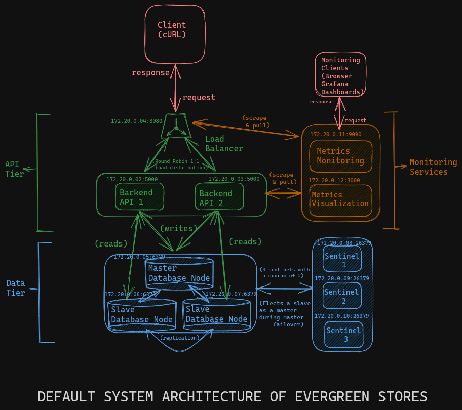

# Evergreen Stores

## Table of Contents

- [Description](#description)
- [Frameworks and Tools](#frameworks-and-tools)
- [Architecture](#architecture)
- [Design Benefits](#design-benefits)
- [Design Flaws](#design-flaws)
- [Prerequisites](#prerequisites)
- [Roadmap](#roadmap)

## Description

Evergreen Stores is a highly available (hence the name) and moderately scalable backend service that primarily was built to propose a blazingly fast online purchase solution that theoretically on a node has no downtime (based on the ideal assumption that the node itself remains prennially healthy).
The main features of this application are:
- **Microservices**: Use of microservices has been done so as to facilitate the segregation of services into individual components that can be scaled and operated individually running as separate containers. The orchestration is done using Docker Compose. This ensures lightweight service deployments that can scale by themselves without resorting to a bulky monolith.
- **In-Memory Key Value Database**: In-Memory database services (Redis, here) store data in memory and not on disk, thus cutting away overhead due to disk I/O. Database operations in this case are elementary enough without the requirement of establishment of relations that would require the use of RDBMS.
- **Timely Backups**: Use of RDB snapshotting for Redis data persistence also gives snapshots of the database that can be shipped out to different servers quickly.
- **Scalability**: The data tier as well as the web tier of the application are intra-nodal horizontally scalable using Docker Compose.
- **Availibility**: The use of Redis Sentinels makes it possible for the data-tier to remain highly available. Nginx used as a layer 7 load balancer facilitates fairly decent availibility of the API-tier for a single-node architecture.
- **Monitoring System**: Prometheus and Grafana monitor system metrics, throughputs and hardware status of the system and can create alerts.

(<a href="#top">Top</a>)

## Frameworks and Tools

The services used are:
- **Flask**: Backend API server. 
- **Redis**: Distrbuted key-value data store.
- **Nginx**: Load balancer.
- **Prometheus**: Metrics aggregation.
- **Grafana**: Metrics visualization.
- **Docker Compose**: Microservices and container orchestration.

(<a href="#top">Top</a>)

## Architecture

There are many components that make up the entire system, supported by certain design choices that shall be explained further. The main parts are:
- **Docker Compose**: 
    - The entire ecosystem runs with each component as a docker container to represent a service, orchestrated by Compose.
    - In case a container fails, it is orchestrated to restart again unless stopped explicitly.
    - Since the system is still basically one single machine, the external failure of which can ultimately bring down all the services contained inside, scalability, albeit horizontal, is intra-nodal and thereby limited.
    - A better strategy would have been to use Docker Swarm or Kubernetes to manage unit services to scale out across multiple nodes. However, that would be beyond the hardware limits at present.
    - All services are connected to the same Docker network and are subnetting under 172.20.0.0/24. The ports and addresses of every service are explicitly declared.
- **Client**: Some user that can access our backend service. Here, the assumption is the use of cURL or Postman for triggering the API. It can also be replaced with a web tier or some respective frontend.
- **Nginx**:
    - It acts as a layer 7 load balancer to route traffic to either of the two API instances.
    - It follows a simple round-robin process of servicing requests to the APIs. If a request goes to the first instance, the next goes to the alternate instance.
    - Client directly communicates with this instance and does not have to know about the existence of any other service.
    - This is the only single point of failure of the whole system.
- **Flask API**:
    - There are two instances of the API backend that run.
    - If an API instance goes down, traffic is served to the other instance until it respawns.
    - If we need to scale out the API tier, this is where we do it.
    - The API basically needs to perform CRUD operations on the data model of a User and a Product. Any transaction that may happen would be a part of the Purchase data model, which is written a bit differently.
- **Redis Database**:
    - The master instance is responsible for the write operations while the two slave instances are responsible for servicing reads.
    - The system is replicated. Every change that happens gets propagated across to all other instances.
    - The persistence of data is achieved by having a Docker Volume externally mount into the containers.
    - Persistence of data is achieved by both RDB (Redis Database) and AOF (Append-Only File). The former is associated with periodic snapshotting of data - no continuous disk I/O for storage. The latter basically creates a file that is a log of all elementary operations executed to reach a particular state.
    - Hence, data is also ready for disaster recovery.
    - The data tier can be scaled by adding in more slaves and masters.
    - When a master dies, we use sentinels to elect a new master from among the slaves, in whose place a new slave would get spawned up. We can verify this behaviour by pausing a master container.
- **Redis Sentinels**
    - There are three such instances to reach a quorum. Each sentinel shall choose a slave to make it the master. The one with the greatest vote becomes the master.
    - The number of sentinels should mostly be decided with respect to the nmber of slaves.
    - If the data tier is scaled out, this tier has to scale out too.
    - There is no chance of failures in this container by itself as such it has no connection to the API directly.
- **Prometheus**
    - It is the monitoring service that scrapes and pulls metrics from all the services it is supposed to monitor over its network.
    - It performs uptime and health checks, scrapes metrics that we define it to scrape using its required APIs.
    - It is quite reliable in a system and has no chances of going down in general.
    - It monitors the data stack using the Redis adapter and directly scrapes the APIs (and, by extension, Nginx).
    - A Docker Volume is mounted into the container to store metric log data.
- **Grafana**:
    - It is used as the visualization tool for the Prometheus reports.
    - Redis Metrics is to be directly be viewed from here and not from Prometheus, since connection is created using a Redis Adapter, not via Prometheus' `metrics/` endpoint.
    - A Docker Volume is mounted into the container to store metric data.

(<a href="#top">Top</a>)

## Design Benefits

- **Redis Over RDBMS**: 
    - The API use case is quite simple - users' information, product's information, a purchase history. This is not too needing of a structured approach that is relation-heavy and thus would have to compulsorily require data organized into tables.
    - In our case (assumed), the primary concern, more than anything else, is speed. Relational queries are not nearly fast enough as compared to a key-value retrieval.
    - Relational databases, in general, would have difficult scaling as efficiently as Redis would.
    - Relational databases, in every cases, would add too much of bulk into the system to be containerized effectively.
- **Monitoring**
    - In a system whose primary goal is high availibility, it is important to be able to witness the downtime of any instance, if any. Prometheus also lets us ship alerts into our emails in case we face an unexpected service downtime.
    - In case of the failure of a component, the usual approach is to backtrack and hunt for the root cause of error. That can be too cumbersome in case of multiple services in the stack. This helps us point at the right direction directly without the waste of time in repairing.
- **Robust Data Tier**
    - There is a guarantee of high availibility, moderate scalability and guaranteed backups as well. This was, anyway, the primary goal of the project (using Redis).

(<a href="#top">Top</a>)

## Design Flaws

There are a lot of flaws in the system. However, the purpose of the design was to build a segment of the components, research their utilities and orchestrate them, rather than incorporate standards that are unreasonable and beyond the scope of the hardware of a regular computer system.  
The immediately recognizable flaws are:
- **Security**: There is no seurity across any tiers of the application.
- **Single Node Architecture**: Docker Swarm or Kubernetes would have been too heavy to run the whole architecture, which is why simple Docker Compose was chosen, with all its limitations.
- **Absence of Autoscaling**: Number of containers are preordained. This leads to useless wastage of resources when load is less and need for manual scaling when container metrics start to shrink (although manual scaling can be eased with the use of alerts in monitoring system).
- **Absence of Logging Architecture**: Monitoring metrics would enable us to realise *where* the mistake is. Logging would let us realise *what* the mistake is. The absense of such machineries in larger systems would spell disasters during debugging sessions.
- **Use of Document Databases Instead of Redis**:
    - The entire data model can be better supported with a document database since data, even here, is represented using hashtable structures in all cases.
    - The speed tradeoff might be negligible in this case.
    - The features of attaining availibility, backups, etc. would surely be available in databases like MongoDB.

(<a href="#top">Top</a>)

## Prerequisites

The only requirements are:
- **Docker**
- An `.env` file with the details for:
    - `REDIS_MASTER_NAME`
    - `REDIS_SENTINEL`
    - `SECRET_KEY`
- System memory: **8 GB**
- 4-core, 1.60GHz.

(<a href="#top">Top</a>)

## Roadmap

There are subsequent upgrades to be made to the project to reach the final stage. Here are a list of all immediate objectives:

- [x] Configure database.
- [x] Develop API.
- [x] Configuring monitoring.
- [x] Design microservices.
- [ ] Add alerting system using Prometheus.
- [ ] Enrich data model of the application.
- [ ] Deploy logging infrastructure.
- [ ] Deploy caching services.
- [ ] Introduce auth and database security configurations.
- [ ] Migrate to Kubernetes when I get a better computer.

(<a href="#top">Top</a>)

